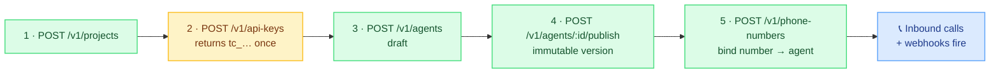

## Base URL

```
http://localhost:8090
```

## Authentication

All authenticated endpoints require an API key:

```
Authorization: Bearer tc_xxxxx
```

API keys are project-scoped. All queries are automatically filtered by the API key's project. Keys are returned once (the raw `tc_...` value); only a hash and the `tc_xxxxxxxx` prefix are stored.

### Platform credential

The two bootstrap endpoints — `POST /v1/projects` and `POST /v1/api-keys` — sit *before* any API key exists, so they are gated by a single platform credential instead:

```
X-Platform-Key: <PLATFORM_API_KEY>
```

The header must match the server's `PLATFORM_API_KEY` setting. The gate fails closed: if `PLATFORM_API_KEY` is unset, every bootstrap call is rejected. This identifies a privileged *caller* (the platform builder), not a user — everything after bootstrap uses project-scoped `tc_...` keys.

### Roles

| Role | Permissions |
|------|-------------|
| `admin` | Full access |
| `developer` | Read/write agents, calls, phone numbers |
| `viewer` | Read-only |

## Resource Lifecycle

The typical setup order — each resource is scoped to the project of the API key that creates it:



## Response Format

### Success

```json
{
  "success": true,
  "data": { ... }
}
```

### Error

```json
{
  "success": false,
  "error": "Human-readable error message",
  "code": "not_found",
  "details": null,
  "request_id": "req_..."
}
```

`code` is a stable machine-readable string; `error` is the human-readable message. `details` and `request_id` are included when available.

### Pagination

```json
{
  "success": true,
  "data": [...],
  "total": 42,
  "page": 1,
  "limit": 20
}
```

## Error Codes

| Code | When |
|------|------|
| `not_found` · `validation_error` · `conflict` · `internal_error` | General |
| `unauthorized` · `forbidden` · `invalid_api_key` · `revoked_api_key` | Auth |
| `agent_not_found` · `agent_already_published` · `invalid_agent_config` | Agents |
| `call_not_found` · `call_not_active` · `invalid_state_transition` | Calls |
| `phone_number_not_found` · `phone_number_already_bound` | Phone numbers |
| `tool_not_found` · `tool_execution_failed` · `tool_timeout` | Tools |
| `twilio_error` · `twilio_signature_invalid` | Twilio |
| `rate_limited` · `concurrency_limit` | Rate limiting |
