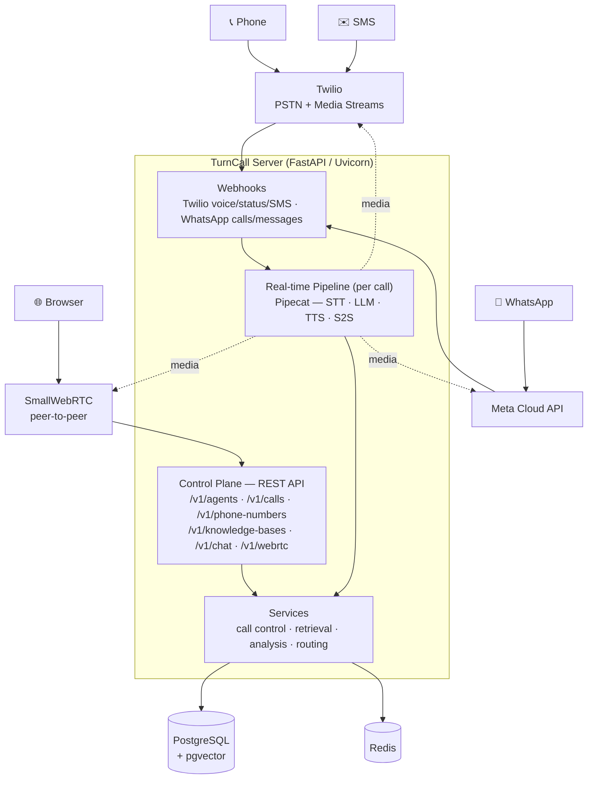
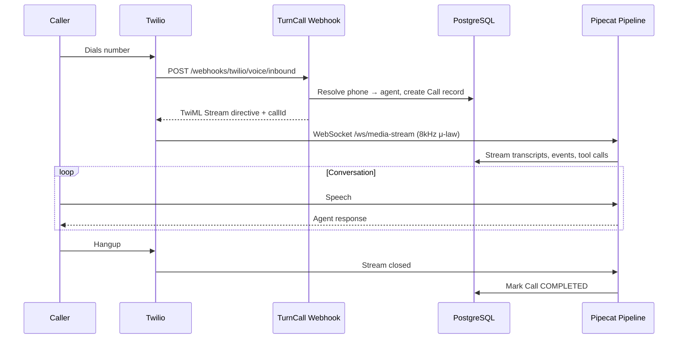
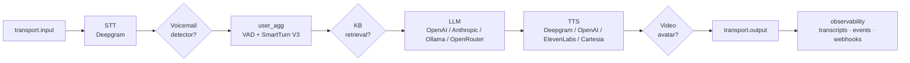
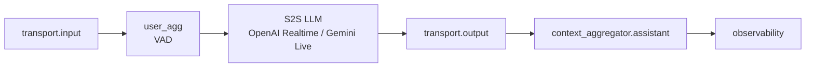
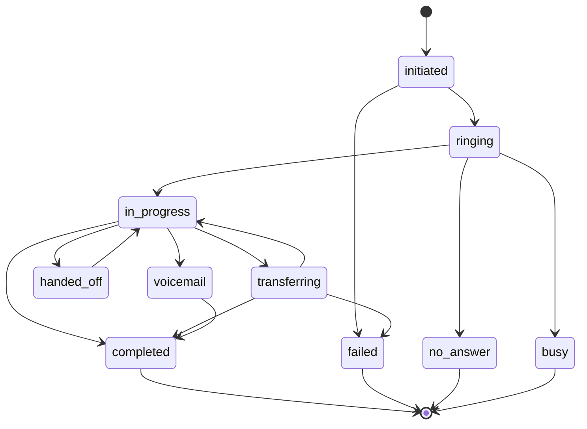
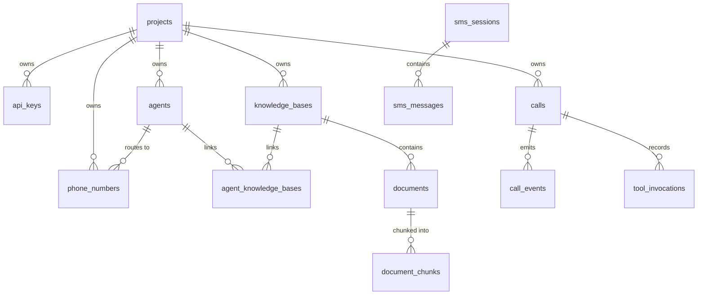

TurnCall is a **modular monolith** (FastAPI) that orchestrates real-time voice AI agents over phone calls, browser WebRTC, WhatsApp, and SMS/chat. All Pipecat code is isolated in `orchestrator/`; every other module is framework-agnostic.

## System Overview

## Inbound Call Flow (Twilio)

<Note>
  Dynamic routing: if the phone number's `routing_target_type` is `webhook`, TurnCall POSTs a **call-init** request to your server first and applies the returned agent / variables / knowledge context before the pipeline starts. See [Pre-Call Init](/guides/call-init).
</Note>

### Other entry points

<AccordionGroup>
  <Accordion title="Outbound call">
    `POST /v1/calls/outbound` creates the Call record and initiates the Twilio call → Twilio hits `/webhooks/twilio/voice/outbound` → the handler resolves the agent from the Call record by `CallSid` → same pipeline as inbound.
  </Accordion>
  <Accordion title="Browser (WebRTC)">
    `POST /v1/webrtc/connect` with an SDP offer → `SmallWebRTCRequestHandler` creates the connection and returns the SDP answer → `PATCH /v1/webrtc/connect` trickles ICE candidates → audio flows peer-to-peer at 16kHz into the same pipeline.
  </Accordion>
  <Accordion title="WhatsApp voice">
    Meta POSTs `/webhooks/whatsapp` (field `calls`) → signature validated → Pipecat `WhatsAppClient` handles the WebRTC SDP exchange → 16kHz `SmallWebRTCTransport` pipeline.
  </Accordion>
  <Accordion title="SMS / Chat (text)">
    Inbound text → resolve session (24h TTL) → build LLM history → chat completion → reply. No Pipecat pipeline — it's a text path through `services/`.
  </Accordion>
</AccordionGroup>

## Real-time Pipeline

Two pipeline modes, selected per agent via `pipeline_mode`.

### Cascade (default, ~800ms)

Optional stages (dashed in the code): **VoicemailDetector** (outbound), **KnowledgeRetrieval** (auto-mode RAG), **video avatar** (HeyGen/Tavus, WebRTC + cascade only). Transcript taps sit after STT and after the LLM to record both sides.

### Speech-to-Speech (~300ms)

A single model handles STT + reasoning + TTS natively over one WebSocket, so the `stt`/`llm`/`tts` config fields are ignored.

<Info>
  Twilio media is 8kHz μ-law on the wire; the serializer converts to/from PCM16. S2S models run at 24kHz, so an internal resampler bridges the rates.
</Info>

## Call State Machine

## Module Responsibilities

| Module | Purpose |
|--------|---------|
| `api/` | REST API — projects, agents, phone numbers, calls, webhooks, WebRTC, chat |
| `auth/` | API key generation (SHA-256, `tc_` prefix), RBAC, project scoping |
| `domain/` | Immutable Pydantic models, enums, call + session state machines |
| `orchestrator/` | Pipecat pipeline — **all** Pipecat imports isolated here |
| `services/` | Call control, SMS/chat, retrieval, analysis, weighted routing, template rendering |
| `storage/` | SQLAlchemy async models, repository pattern, PostgreSQL + Redis |
| `adapters/` | Object storage (local filesystem, S3) |
| `events/` | Webhook delivery, server events, signing |
| `webhooks/` | Twilio + WhatsApp handlers, media stream WebSocket |

## Data Model

| Table | Purpose |
|-------|---------|
| `projects` | Tenant boundary |
| `api_keys` | Auth (hashed, prefix-indexed) |
| `agents` | Versioned voice agent configs (JSONB `config_blob`) |
| `phone_numbers` | Twilio number → agent routing (incl. weighted A/B) |
| `calls` | Call records with state machine |
| `call_events` | Event log — transcripts, tools, transfers |
| `tool_invocations` | Tool execution audit (input/output/latency) |
| `webhook_subscriptions` | Outbound webhook config |
| `knowledge_bases` · `documents` · `document_chunks` | RAG — metadata, files, pgvector embeddings |
| `agent_knowledge_bases` | Agent ↔ KB links with retrieval mode |
| `sms_sessions` · `sms_messages` | SMS/chat session + message history |
| `test_suites` · `test_runs` | Agent test scenarios + results |
