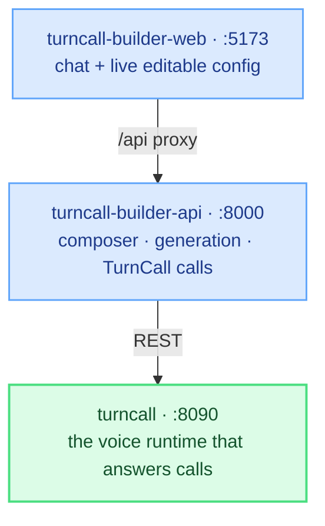

The **Agent Builder** is a separate, source-available app that turns a
conversation into a deployed TurnCall agent. You describe what you want, it
asks follow-up questions until the design is unambiguous, generates the agent
config, and creates it in your TurnCall instance.

It's two repos — a FastAPI backend and a React console — running alongside the
engine:



The engine is MIT; the two builder repos are source-available under FSL-1.1-ALv2.

<Note>
Not to be confused with the **TurnCall skill** for Claude Code, described in
[Building Apps](/guides/building-apps). That plugin writes *integration code*
for your app. The Agent Builder is an app that creates *agents*.
</Note>

## Before you start

Have TurnCall itself running and working first — the builder has no voice
runtime of its own and calls your instance's API. Follow the
[Quickstart](/quickstart) up to talking to an agent in the browser, then come
back. That takes about ten minutes and needs no phone number.

You'll also need:

- **Node 20+** for the console
- An **Anthropic API key** — the builder uses Claude to run the conversation
  (set `BUILDER_PROVIDER=openai` in its `.env` to use OpenAI instead)

## 1. Start the engine

In the `turncall` repo:

```bash
make docker-up-local && make migrate-local
```

<Warning>
Which command you use decides your container names. `make docker-up-local`
gives `turncall-local-*`; `make docker-up` gives `localstack-*`. The builder
reaches into these containers by name and has a matching target for each — use
the pair that matches, or you'll get a container-not-found error.
</Warning>

## 2. Start the builder API

```bash
git clone https://github.com/kobikis/turncall-builder-api.git
cd turncall-builder-api
cp .env.example .env
```

Set two things in `.env`:

```
ANTHROPIC_API_KEY=sk-ant-xxxxxxxx
PLATFORM_API_KEY=dev-platform-key      # must match TurnCall's
```

<Warning>
`PLATFORM_API_KEY` must be **identical** to the value in TurnCall's `.env`.
The builder mints its own TurnCall API key through the platform-gated
bootstrap endpoints; a mismatch fails with a 401.
</Warning>

Then provision and start:

```bash
make turncall-setup      # mints a TurnCall API key into .env
make docker-up-local     # pairs with TurnCall's make docker-up-local
```

`turncall-setup` is required on a first run, not only after a reset — without
it there's no `TURNCALL_API_KEY` and the builder can't create anything.

## 3. Start the console

```bash
git clone https://github.com/kobikis/turncall-builder-web.git
cd turncall-builder-web
make install
make dev
```

Opens on [http://localhost:5173](http://localhost:5173). The dev server proxies `/api` to the builder
API on `:8000`, so both must be running.

## 4. Log in

Skip Google OAuth for local use. Back in `turncall-builder-api`:

```bash
make seed-guest
```

Then log in at [http://localhost:5173](http://localhost:5173) with `guest@turncall.local` / `guest`.
It lands in an admin workspace, ready to create agents.

## 5. Describe an agent

Type what you want in plain language:

> a receptionist for my dental clinic that can book appointments

The builder asks what it needs to know — opening hours, what to do out of
hours, when to transfer to a human — and assembles a config on the right as it
goes. Edit it directly if you disagree with a choice.

When it looks right, hit **Create in TurnCall**. The agent is created in your
instance through the API, exactly as if you'd written the config by hand.

## 6. Talk to it

The agent is a normal TurnCall agent now. Talk to it in the browser with the
[WebRTC client](/quickstart#talk-to-it), or bind a phone number to it and
call it for real.

The events panel polls your instance, so you can watch what its calls produce
as they happen.

## 7. Push the agent to your own GitHub

Every created agent gets a generated **Agent Backend** — a FastAPI service
holding its custom tool handlers, its `/events` receiver and its call-init
endpoint. By default that code lives only in the builder's Docker environment.
You can push it to a repository you own and run it yourself.

<Note>
  Nothing is ever created on your GitHub. You choose an existing repository, a
  branch and an optional folder — the builder only writes into it.
</Note>

### Connect your account

GitHub connections are **per person**, not per workspace: the credential is
authorized by you against an account you control, and pushes are attributed to
you. Click **GitHub** in the sidebar footer, next to your email.

You need a [fine-grained personal access token](https://github.com/settings/personal-access-tokens/new):

<Steps>
  <Step title="Pick the repositories">
    Under **Repository access**, choose *Only select repositories* and select
    the ones agents will push to.
  </Step>
  <Step title="Grant one permission">
    Under **Permissions → Repository**, set **Contents: Read and write**.
    That is the only one needed — `Metadata: Read-only` is added automatically.
  </Step>
  <Step title="Paste it in">
    Generate, copy it once, and paste it into the console. It is stored
    encrypted and never shown again.
  </Step>
</Steps>

<Warning>
  If the repositories belong to an **organisation**, it may need to approve the
  token before it works — check *Org settings → Third-party Access → Personal
  access tokens*. Until then the token looks valid but sees nothing.
</Warning>

### Link a repository

Open an agent, go to the **Code** tab, and choose a repository, a branch, and
optionally a folder inside it.

The folder is what lets one repository hold several agents:

```
my-agents/
├── agents/
│   ├── receptionist/     ← folder: "agents/receptionist"
│   └── dental-booking/   ← folder: "agents/dental-booking"
└── README.md             ← yours, never touched
```

Leave it empty to use the repository root instead — one repository per agent.

### What a push contains

| File | What it is |
|------|------------|
| `app.py`, `Dockerfile`, `docker-compose.yml`, `requirements.txt` | The Agent Backend service |
| `agent.json` | The agent's prompt, model, voice, tools and guardrails |
| `.env.example` | The variables the service needs, with no values |
| `README.md` | How to run it |

Editing the prompt or model changes `agent.json` only. The code changes when
the agent's **custom tools** change, because that is what the backend
implements.

`.env` is never pushed, and secrets inside `agent.json` are redacted to `***`.

### Running it yourself

```bash
git clone https://github.com/<you>/<repo>.git
cd <repo>/<folder>
cp .env.example .env     # then fill it in
docker compose up -d --build
```

### If someone edits the repository

Pushes are one-way and never forced. If the agent's files change on GitHub, the
next push **refuses** and tells you, rather than overwriting the change — the
Code tab links to the diff so you can reconcile it in your own repository
first.

Disconnecting, unlinking or deleting the agent never deletes anything on
GitHub.

## Licensing

The engine is MIT. The two builder repos are **source-available under
FSL-1.1-ALv2**: use, modify and redistribute for any purpose except competing
with us, and each release converts to Apache 2.0 two years after it ships. See
`adr/0015-open-core-licensing.md`
for the reasoning.

## Troubleshooting

| Symptom | Cause |
|---|---|
| `make turncall-setup` fails with 401 | `PLATFORM_API_KEY` differs between the two `.env` files |
| container-not-found on builder start | Used `make docker-up` on one side and `docker-up-local` on the other |
| Console loads but calls fail | The builder API isn't running on `:8000` — the Vite proxy has nothing to reach |
| Agents created but calls don't connect | Provider keys live in **TurnCall's** `.env`, not the builder's — the pipeline runs in the engine |
