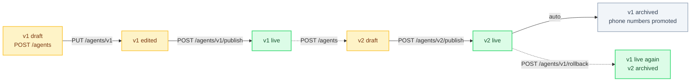

TurnCall uses a linear version model with auto-promotion. Each published version is immutable — edit the draft, publish when ready.

## Lifecycle



Each published version is immutable — editing after publish means a new draft.

## States

| State | Description |
|-------|-------------|
| `draft` | Editable. Not yet live. |
| `published` | Immutable. Active and serving calls. |
| `archived` | Immutable. Previously published, auto-archived when a newer version is published. |

## Publish

Publishing a new version auto-archives the previous published version and auto-updates all phone numbers.

```bash
curl -X POST http://localhost:8090/v1/agents/AGENT_ID/publish \
  -H "Authorization: Bearer tc_xxx"
```

## Version History

```bash
curl http://localhost:8090/v1/agents/AGENT_ID/versions \
  -H "Authorization: Bearer tc_xxx"
```

## Rollback

Restore a previously published version:

```bash
curl -X POST http://localhost:8090/v1/agents/OLD_VERSION_ID/rollback \
  -H "Authorization: Bearer tc_xxx"
```

This restores the old version to `published`, archives the current version, and updates all phone number routing.
