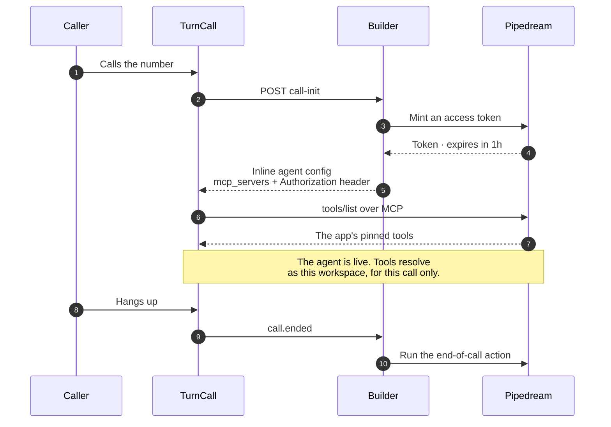

An agent can act in your Slack workspace or your Google Calendar — during a
call, because the model decided to, or **when a call ends**, because the call
ended. Authorization happens once for the whole workspace, through the
provider's own consent screen.

This is a feature of the [Agent Builder](/guides/agent-builder), not of the
engine. The engine sees only ordinary [MCP servers](/guides/mcp); the builder is
what mints their credentials and puts a Console on top.

<Note>
  Nothing here is required to use a third-party tool. Any MCP server can be
  wired to an agent by hand with [`mcp_servers`](/guides/mcp), and always could.
  What Connected apps add is managed authorization, a catalog, and something to
  run after the call.
</Note>

## How it fits together

```mermaid
flowchart LR
    Admin["👤 Workspace admin"] -->|"authorizes once"| Consent["🔐 Provider consent screen"]
    Consent --> PD[("Pipedream<br/>holds the tokens")]

    subgraph Builder["Builder — holds one encrypted client credential"]
        direction TB
        Cfg["⚙️ Agent · Configuration tab<br/>attach an app, choose when it runs"]
    end

    PD -.->|"which accounts exist, never the tokens"| Cfg

    Cfg --> During["🗣️ During a call<br/>the app's tools, offered to the model"]
    Cfg --> After["📤 When a call ends<br/>one action, decided up front"]

    During --> Maybe["The model calls it —<br/>or decides not to"]
    After --> Always["call.ended arrives<br/>delivered at least once<br/>runs at most once"]

    Maybe --> Apps["💬 Slack<br/>📅 Google Calendar"]
    Always --> Apps

    classDef client fill:#dbeafe,stroke:#60a5fa,stroke-width:1.5px,color:#1e3a8a
    classDef vendor fill:#f1f5f9,stroke:#94a3b8,stroke-width:1.5px,color:#334155
    classDef core fill:#dcfce7,stroke:#4ade80,stroke-width:1.5px,color:#14532d
    classDef store fill:#fef3c7,stroke:#fbbf24,stroke-width:1.5px,color:#78350f
    class Admin client
    class Consent,Apps vendor
    class Cfg,During,After core
    class PD store
    style Builder fill:#f8fafc,stroke:#cbd5e1,color:#0f172a
```

The two paths out of that diagram are the whole design: one is a *capability* the
model may or may not use, the other is a *guarantee* that fires because an event
arrived. Choosing between them is the question this feature asks you.

TurnCall never holds the third party's tokens. The builder stores one encrypted
Pipedream client credential; everything a call needs is minted for that call and
expires within the hour.

## Setup

You need a [Pipedream](https://pipedream.com) account and a Connect project.
Four values go in the builder API's `.env`:

| Variable | What it is |
|----------|------------|
| `PIPEDREAM_CLIENT_ID` | your Pipedream OAuth client |
| `PIPEDREAM_CLIENT_SECRET` | the same client's secret — stored encrypted, never in an agent's config |
| `PIPEDREAM_PROJECT_ID` | the Connect project (`proj_…`) |
| `PIPEDREAM_REDIRECT_URI` | where Pipedream sends the admin back: your **builder API's** `/integrations/callback`, not the Console's URL |
| `PIPEDREAM_ENCRYPTION_KEY` | `python -c "from cryptography.fernet import Fernet; print(Fernet.generate_key().decode())"` |
| `PIPEDREAM_ENVIRONMENT` | `development` (default) or `production`. Pipedream's development environment caps how many accounts can be connected |

<Warning>
  `PIPEDREAM_REDIRECT_URI` is the one people get wrong. It is an API route, and
  it must match what Pipedream is configured to allow, character for character.
</Warning>

Restart the builder API. Without these, the Integrations page says so rather
than failing obscurely.

## Connecting an app

On the Console's **Integrations** page, an admin picks an app and is sent to
Pipedream's hosted consent screen. The builder never renders the third party's
login and never sees what is typed into it. Coming back, it asks Pipedream what
now exists.

Connecting is a **workspace** act and needs admin. Choosing which agent uses an
app, and when, is a per-agent act on that agent's **Configuration** tab.

## Choosing when it runs

The two triggers are deliberately not symmetric, because they answer different
questions.

<Tabs>
  <Tab title="During a call">
    The app's tools are offered to the model, which calls them if it decides to.
    A *set*, with the arguments supplied at runtime.

    Nothing guarantees it fires. If the summary has to be posted, this is the
    wrong half.

    Each app contributes a pinned list of tools, not everything it can do —
    Slack alone has 50 actions, against a cap of 50 tools per server and 100 per
    agent, and every advertised tool rides in every request for the length of the
    call.
  </Tab>
  <Tab title="When a call ends">
    One action runs because the `call.ended` event arrived. Nothing chooses at
    runtime, so the action and its arguments are decided up front.

    Delivered at least once, run at most once — the agent's backend keys on the
    event's `event_id`, so a redelivery cannot post twice.

    The agent's own summary of the call is included automatically. You choose
    where it goes, not what it says.
  </Tab>
</Tabs>

An app can carry either, both, or — usefully — only the second. An agent that
should post a summary and nothing else hands the model no Slack tools at all.

## What is on offer

| App | During a call | When a call ends |
|-----|---------------|------------------|
| **Slack** | post a message, list channels, find a user by email | post the call summary to a channel |
| **Google Calendar** | create, update, list and get events; check free/busy | add the call to a calendar |

Values you cannot check by eye are **chosen from a list**, not typed: a Slack
channel is picked by name and stored by id, and so is a calendar. That list is
fetched from your own connected account, so it is the real one.

<Tip>
  "Add the call to a calendar" records the call itself — an entry spanning it,
  with the summary in the description. Booking something *for the caller* is a
  different job and belongs in the system prompt, as a tool the agent calls
  during the call. Asking for both gets you two events.
</Tip>

Scheduling a **follow-up** when a call ends is not offered. A `call.ended`
payload says when the *call* finished, not when a meeting should be — an action
that configured cleanly and failed every night would be worse than one that
isn't there.

## Why the list is short

Two apps, curated in code. Adding a third is deliberate rather than automatic,
for two reasons: the pinned tool list is load-bearing against the per-agent tool
cap above, and an end-of-call action needs a human decision about which of its
inputs can be known before the call happens.

Anything not on the list is still reachable today as a raw
[MCP server](/guides/mcp), with credentials you manage.

## What a call actually receives

Attaching an app mid-call adds an `mcp_servers` entry to the agent's config for
that call, with an `Authorization` header minted at call time. It reaches the
call through [call-init](/guides/call-init) as an **inline agent** — the only
path that can carry a credential without storing one.

Nothing in that exchange is stored. The token outlives the call by less than an
hour, and the agent's own config never contains one.

That has a visible consequence, which the call-init guide covers in full: such a
call has no stored agent, so every event for it carries `agent_id: null`.
Correlate on `call_id`.
