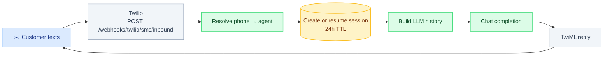

TurnCall supports text-based conversations via Twilio SMS and the Chat API. Agents use the same LLM configuration as voice but respond with text.

## SMS Flow



No Pipecat pipeline is involved — this is a text path through `services/`.

### Enable SMS on a Phone Number

Set `sms_enabled: true` when binding a phone number. TurnCall auto-configures the Twilio SMS webhook.

The same number handles both voice calls and SMS.

## Chat API

Use the Chat API for programmatic text conversations:

```bash
# Send a message
curl -X POST http://localhost:8090/v1/chat \
  -H "Authorization: Bearer tc_xxx" \
  -H "Content-Type: application/json" \
  -d '{
    "agent_id": "AGENT_ID",
    "message": "What are your hours?",
    "customer_number": "+15559876543",
    "turncall_number": "+15551234567"
  }'
```

### Endpoints

| Method | Path | Description |
|--------|------|-------------|
| POST | `/v1/chat` | Send message, get LLM reply |
| GET | `/v1/chat/sessions` | List sessions |
| GET | `/v1/chat/sessions/:id` | Get session detail |
| GET | `/v1/chat/sessions/:id/messages` | List messages |
| DELETE | `/v1/chat/sessions/:id` | Expire session |

## Context Threading

Use `session_id` (group messages) or `previous_chat_id` (linear chain) to maintain conversation context. Cannot use both.

## Session Management

- **Auto-created** on first inbound SMS or Chat API call
- **Resumed** if same (customer_number, turncall_number) pair and &lt;24h since last activity
- **Expired** after 24h inactivity (lazy on lookup + background cleanup every 15 min)

### Webhook Events

- `session.created`
- `session.updated`
- `session.deleted`
- `chat.created`
