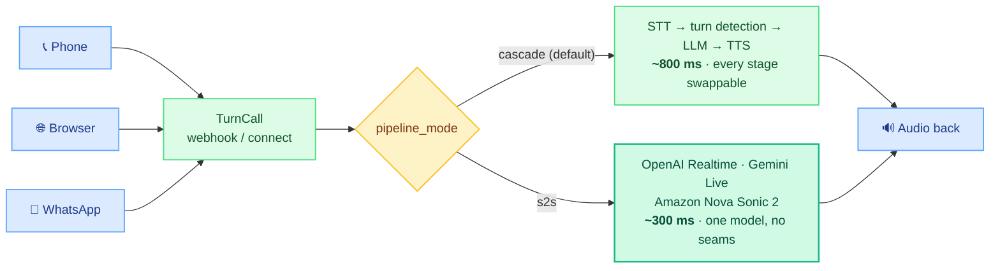

TurnCall lets developers deploy AI voice agents over phone calls, WebRTC browser calls, WhatsApp, and SMS — with configurable providers, tool calling, call transfers, voicemail detection, and bidirectional server events.

Define an agent via API, bind it to a phone number, and callers talk to your AI.

## Features

<CardGroup cols={2}>
  <Card title="Twilio PSTN Calls" icon="phone">
    Inbound and outbound phone calls via Twilio Voice + Media Streams.
  </Card>
  <Card title="WebRTC Browser Calls" icon="globe">
    Talk to agents directly from the browser with peer-to-peer audio.
  </Card>
  <Card title="Video Avatar" icon="user-circle">
    Optional lip-synced video avatar (HeyGen or Tavus) on WebRTC cascade calls.
  </Card>
  <Card title="WhatsApp Business" icon="whatsapp" color="#25D366">
    Voice calls and text messages via WhatsApp Cloud API.
  </Card>
  <Card title="SMS / Chat" icon="message">
    Text-based conversations with agents via Twilio SMS or the Chat API.
  </Card>
  <Card title="Multi-Provider" icon="shuffle">
    Mix and match STT, LLM, and TTS providers per agent — Deepgram, OpenAI, Anthropic, ElevenLabs, Cartesia, Ollama.
  </Card>
  <Card title="Speech-to-Speech" icon="bolt">
    Ultra-low latency (~300ms) via OpenAI Realtime, Gemini Live or Amazon Nova Sonic.
  </Card>
  <Card title="Tool Calling" icon="wrench">
    Built-in tools (transfer, handoff, DTMF) + webhook tools + MCP servers.
  </Card>
  <Card title="Knowledge Base (RAG)" icon="book">
    Upload documents with three retrieval modes: prompt, auto, and tool.
  </Card>
  <Card title="Agent Versioning" icon="code-branch">
    Publish immutable versions, auto-promote phone numbers, rollback instantly.
  </Card>
  <Card title="A/B Testing" icon="flask">
    Weighted traffic routing on phone numbers, deterministic by caller.
  </Card>
  <Card title="Post-Call Analysis" icon="chart-bar">
    Automatic summary, sentiment, success evaluation, and structured extraction.
  </Card>
  <Card title="Server Events" icon="arrows-left-right">
    Bidirectional hooks — call-init, function-call, call-end, transcript updates.
  </Card>
</CardGroup>

## How It Works

A caller connects over any transport; TurnCall runs a per-call Pipecat pipeline in one of two modes and streams audio back.

See [Architecture](/architecture) for the full pipeline, call flows, and data model.

## Tech Stack

| Component | Technology |
|-----------|-----------|
| Framework | FastAPI + Uvicorn |
| Voice Pipeline | Pipecat 1.8 |
| Database | PostgreSQL + SQLAlchemy async + Alembic |
| Cache | Redis |
| Telephony | Twilio Voice + Media Streams |
| Browser | WebRTC (SmallWebRTCTransport) |
| Video Avatar | HeyGen / Tavus (Pipecat avatar services) |
| STT | Deepgram / OpenAI / ElevenLabs / Cartesia |
| LLM | OpenAI / Anthropic Claude / Ollama / OpenRouter / AWS Bedrock / Any OpenAI-compatible |
| TTS | Deepgram / OpenAI / ElevenLabs / Cartesia |
| S2S | OpenAI Realtime / Gemini Live / Amazon Nova Sonic 2 |
| Knowledge Base | pgvector + OpenAI embeddings |
| VAD | Silero |
| Turn Detection | Smart Turn V3 (local ONNX) |

## Build agents by describing them

Prefer not to hand-write agent configs? The
[Agent Builder](/guides/agent-builder) turns a plain-English description into a
deployed agent — it asks follow-up questions, generates the config, and creates
it in your instance.

It's a separate, source-available app that runs alongside this engine.
