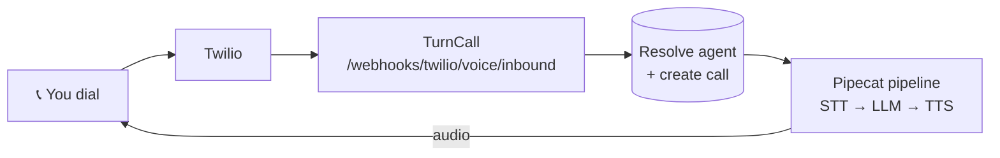

Two paths. **Start with the browser one** — no Twilio account, no phone
number, no tunnel, so you find out whether you like this before spending
money.

| | Browser (WebRTC) | Phone (Twilio) |
|---|---|---|
| Time | ~10 min | +15–20 min |
| Needs | Docker, 2 free API keys | also Twilio, a number, ngrok |
| Costs | nothing | a number is ~$1/mo |

## Prerequisites

**For the browser path:**

- Docker (runs Postgres, Redis and the API)
- Node 20+ (for the browser client)
- OpenAI API key (or Ollama for a local LLM)
- Deepgram API key (free at [console.deepgram.com](https://console.deepgram.com))

**Additionally for phone calls:** a Twilio account with a number, and ngrok.

Python 3.12+ is only needed for host development.

## Setup

<Steps>
  <Step title="Clone and install">
    ```bash
    git clone https://github.com/kobikis/turncall.git
    cd turncall
    python -m venv .venv
    source .venv/bin/activate
    make dev
    ```
  </Step>
  <Step title="Configure environment">
    ```bash
    cp env.example .env
    ```

    Edit `.env` with your credentials:

    For the browser path, **two keys are all you need**:

    ```bash .env
    OPENAI_API_KEY=sk-xxxxxxxx
    DEEPGRAM_API_KEY=xxxxxxxx
    ```

    Everything else in `env.example` already has a working local default.
    Twilio credentials are **not required to boot** — leave them blank until
    you want phone calls.

    `PLATFORM_API_KEY` ships with a dev default (`dev-platform-key`) that gates
    project and API-key creation — the examples read it automatically. Set a
    strong unique value in production.
  </Step>
  <Step title="Start the stack">
    ```bash
    make docker-up    # Postgres + Redis + TurnCall API (:8090) + LocalStack
    make migrate      # Create database tables
    ```

    The API is now serving on `http://localhost:8090`. To iterate on server
    code with hot reload instead, stop the `turncall` container (both bind
    `:8090`) and use `make run`.
  </Step>
  <Step title="Seed an agent">
    ```bash
    bash scripts/seed_dev.sh
    ```

    Creates a project, an API key and a published receptionist agent, and
    prints both — **the key is shown once**. No phone number involved.
  </Step>
  <Step title="Talk to it">
    ```bash
    cd examples/webrtc-client
    npm install
    npm run dev
    ```

    Open [http://localhost:5173](http://localhost:5173), paste in the server URL
    (`http://localhost:8090`), the `tc_...` key and the agent id from the
    previous step, then click **Start Call** and talk.

    Audio goes over WebRTC straight to your own machine — speech → Deepgram →
    GPT-4o-mini → Deepgram TTS → speech, in roughly 800 ms.
  </Step>
</Steps>

## Talk to it

That's the whole loop, with no telephony involved: **speech → Deepgram →
GPT-4o-mini → Deepgram TTS → speech**, in roughly 800 ms.

Things worth trying before you add a phone number:

- Change `system_prompt` on the agent and reconnect — the personality is one field.
- Swap `tts.provider` to `cartesia` or `elevenlabs` for a different voice.
- Set `pipeline_mode: "s2s"` to route through OpenAI Realtime instead, which
  drops latency to roughly 300 ms. See [Speech-to-Speech](/guides/s2s).
- Point `llm.provider` at `ollama` to run the model locally, so nothing but
  audio transcription leaves your machine.

Prefer describing an agent to writing its config? The
[Agent Builder](/guides/agent-builder) does that.

## Answer a real phone call

Everything above needed no Twilio. To have the agent pick up an actual phone,
you now also need a Twilio account, a number (~$1/mo) and a tunnel.

<Steps>
  <Step title="Expose via ngrok">
    ```bash
    ngrok http 8090
    # copy the https:// forwarding URL — it changes on each restart
    ```
  </Step>
  <Step title="Add the Twilio values to .env">
    ```bash .env
    TWILIO_ACCOUNT_SID=ACxxxxxxxx
    TWILIO_AUTH_TOKEN=xxxxxxxx
    TURNCALL_NUMBER=+15559876543            # your Twilio number, E.164
    TWILIO_PN_SID=PNxxxxxxxx                # its Phone Number SID
    PUBLIC_BASE_URL=https://xxxx.ngrok.io   # the ngrok URL
    ```
  </Step>
  <Step title="Bind the number">
    ```bash
    ./examples/receptionist/run.sh
    ```

    Or re-run the seed script with the number set, binding it to the agent you
    already talked to:

    ```bash
    TURNCALL_NUMBER=+15559876543 bash scripts/seed_dev.sh
    ```
  </Step>
  <Step title="Call your number">
    The receptionist answers, understands your intent, and routes accordingly.
  </Step>
</Steps>

## What You Just Built



Twilio opens a media-stream WebSocket to `/ws/media-stream`; the pipeline runs until you hang up, then the call is marked `completed`.

## Manual Setup via API

If you prefer to set things up step by step:

### Create a project

Project and first-API-key creation are gated by the platform credential —
send `X-Platform-Key` matching your `PLATFORM_API_KEY`:

```bash
curl -X POST http://localhost:8090/v1/projects \
  -H "X-Platform-Key: dev-platform-key" \
  -H "Content-Type: application/json" \
  -d '{"name": "my-project"}'
```

### Create an API key

```bash
curl -X POST "http://localhost:8090/v1/api-keys?project_id=PROJECT_ID" \
  -H "X-Platform-Key: dev-platform-key" \
  -H "Content-Type: application/json" \
  -d '{"name": "dev-key", "role": "admin"}'
# Save the raw_key from the response
```

### Create an agent

```bash
curl -X POST http://localhost:8090/v1/agents \
  -H "Authorization: Bearer tc_xxx" \
  -H "Content-Type: application/json" \
  -d '{
    "name": "my-agent",
    "config": {
      "system_prompt": "You are a helpful assistant.",
      "first_message": "Hello! How can I help?",
      "stt": {"provider": "deepgram", "model": "nova-3-general", "language": "en"},
      "llm": {"provider": "openai", "model": "gpt-4o-mini", "temperature": 0.7, "max_tokens": 1024},
      "tts": {"provider": "deepgram", "voice": "aura-2-helena-en"}
    }
  }'
```

### Publish the agent

```bash
curl -X POST http://localhost:8090/v1/agents/AGENT_ID/publish \
  -H "Authorization: Bearer tc_xxx"
```

### Bind a phone number

```bash
curl -X POST http://localhost:8090/v1/phone-numbers \
  -H "Authorization: Bearer tc_xxx" \
  -H "Content-Type: application/json" \
  -d '{
    "external_number_sid": "PNxxxxxxxx",
    "e164_number": "+15559876543",
    "routing_target_type": "agent",
    "routing_target_id": "AGENT_ID"
  }'
```

### Configure Twilio webhooks

Set your Twilio number's webhook URLs:
- **Voice URL**: `https://xxxx.ngrok.io/webhooks/twilio/voice/inbound` (POST)
- **Status URL**: `https://xxxx.ngrok.io/webhooks/twilio/status` (POST)

### Call your number

That's it — call the number and talk to your agent.

## Environment Variables

| Variable | Required | Description |
|----------|----------|-------------|
| `DATABASE_URL` | Yes | PostgreSQL connection string |
| `REDIS_URL` | Yes | Redis connection string |
| `TWILIO_ACCOUNT_SID` | No* | Twilio account SID. *Required for phone calls, not the browser path |
| `TWILIO_AUTH_TOKEN` | No* | Twilio auth token. *Required for phone calls, not the browser path |
| `OPENAI_API_KEY` | Yes* | OpenAI API key. *Not required if using Ollama |
| `DEEPGRAM_API_KEY` | Yes | Deepgram API key |
| `ELEVENLABS_API_KEY` | No | ElevenLabs API key |
| `CARTESIA_API_KEY` | No | Cartesia API key |
| `ANTHROPIC_API_KEY` | No | Anthropic API key (for Claude) |
| `GOOGLE_API_KEY` | No | Google API key (for Gemini Live S2S) |
| `OPENROUTER_API_KEY` | No | OpenRouter API key (multi-model + fallback routing) |
| `HEYGEN_LIVE_AVATAR_API_KEY` | No | HeyGen video avatar (LiveAvatar key, app.liveavatar.com) |
| `TAVUS_API_KEY` | No | Tavus video avatar (platform.tavus.io) |
| `PUBLIC_BASE_URL` | No* | Public HTTPS base URL for Twilio callbacks (e.g. `https://abc.ngrok.io`). *Required for warm [call transfer](/guides/tools) and no-answer fallback. |
| `OTEL_EXPORTER_OTLP_ENDPOINT` | No | OTLP collector for [OpenTelemetry traces](/guides/observability) (e.g. `http://localhost:4318`). Required for tracing in production. |

See [Providers](/guides/providers) for provider-specific configuration and [Video Avatar](/guides/video-avatar) for avatars.
